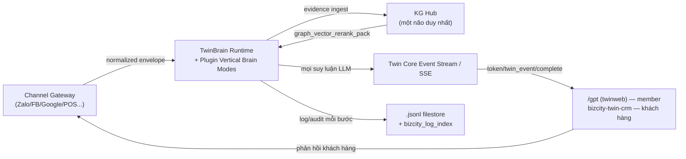

# 00 — VIBE CANON: All Channel, One Brain

> **Status:** 🟡 MỘT PHẦN — tái xác nhận hướng đi đã có trong
> [PHASE-0-RULE-ENTERPRISE-BRAIN-DIRECTION.md](../rules/PHASE-0-RULE-ENTERPRISE-BRAIN-DIRECTION.md)
> và [PHASE-0-RULE-BRAIN-UNIFICATION.md](../rules/PHASE-0-RULE-BRAIN-UNIFICATION.md),
> đóng khung lại thành 1 mục tiêu kỹ thuật cụ thể: **closed-loop vibe coding**.
> **Không override** hai rule trên — nếu có khác biệt câu chữ, hai rule đó thắng.
>
> **Cập nhật 2026-08-29:** đã bổ sung tôn chỉ #2 (Twin Data Center) và
> đối chiếu lại toàn bộ tài liệu với code thật — xem
> [13-GAP-CRITIQUE-READINESS-REVIEW.md](13-GAP-CRITIQUE-READINESS-REVIEW.md).
> Mọi checklist/trạng thái wave theo dõi tập trung tại
> [MASTER-CHECKLIST.md](MASTER-CHECKLIST.md), không phân mảnh trong từng file.

---

## 1. Tuyên ngôn toàn hệ thống

> **"All Channel, One Brain."**

Mọi channel, dữ liệu, chức năng và nhu cầu của doanh nghiệp cùng quy tụ về một
bộ não chung để hiểu, phân tích, quyết định và hành động nhất quán. Đây là
thông điệp dành cho CEO, marketer, chủ doanh nghiệp, Dev và mọi người dùng của
Bizcity Twin AI.

## 1.1 Nguyên tắc triển khai cho Dev

> **"Muốn thêm khả năng → thêm plugin. Không sửa Core."**

Đây là điều kiện cần để một cộng đồng lập trình viên/AI agent bên ngoài có thể
mở rộng nền tảng một cách an toàn: họ **không bao giờ cần sửa `core/`**, chỉ
cần viết một plugin mới tuân theo hợp đồng (contract) đã công bố. Toàn bộ
folder `docs/vibe/` tồn tại để biến câu tôn chỉ này từ khẩu hiệu thành một quy
trình có thể kiểm chứng bằng máy (Diagnostics PASS/FAIL), không phải bằng
niềm tin.

## 1.2 Tôn chỉ #2 — Twin Data Center, không phải chatbot

> **"Hướng đi của Twin Framework không phải là xây dựng 1 chatbot thông
> minh, mà là trở thành 1 Twin Data Center — tập trung dòng chảy dữ liệu,
> các plugin, ứng dụng của doanh nghiệp về 1 chỗ để phân tích, tổng hợp,
> trợ giúp doanh nghiệp định hướng, đánh giá, đưa ra chiến lược qua
> dashboard. Thế mạnh là phân tích, tối ưu, graph hoá dữ liệu khi đã
> unify về 1 nơi. Từ đó doanh nghiệp chỉ cần cắm MCP vào là có thể dùng
> Claude/ChatGPT làm việc."** — Johnny Chu, 2026-08-29.

Tôn chỉ này **không thay thế** tôn chỉ #1 — nó định nghĩa **MỤC TIÊU CUỐI** mà
7 verb SDK/plugin phải phục vụ, thay vì chỉ đo thành công bằng "câu trả
lời chat hay hơn". Hệ quả cụ thể:

- KG Hub không chỉ là nguồn tri thức để trả lời câu hỏi — nó còn là nguồn
  **graph** để phân tích quan hệ/xu hướng dữ liệu doanh nghiệp.
- Filestore JSONL ([02](02-FILESTORE-LOG-INDEX-STANDARD.md)) không chỉ để
  audit/debug — nó là tín hiệu time-series cho tầng phân tích.
- MCP (`core/mcp`) không chỉ cho Claude/ChatGPT gọi tool — nó phải cho
  phép truy vấn dữ liệu tổng hợp đa plugin (đã có mầm mống: MCP
  Business/Report/Commerce service — xem
  [13](13-GAP-CRITIQUE-READINESS-REVIEW.md) §5).
- Thước đo thành công không chỉ là "câu trả lời đúng, có citation" mà còn
  là "doanh nghiệp thấy được insight tổng hợp mà trước đây phải tự tổng
   hợp tay từ N hệ thống". Một insight chỉ thành công khi có accuracy trong
   snapshot đã khai báo, citation/link resolve được, source và plugin, event/
   trace lineage, timestamp/window, record/CPT reference và storage locator
   đã xác minh (xem [11-SCOREBOARD-AUDIT-FRAMEWORK.md §7](11-SCOREBOARD-AUDIT-FRAMEWORK.md)
   và Wave 10 trong
  [12-ROADMAP-CLOSED-LOOP-VIBE-CODING.md](12-ROADMAP-CLOSED-LOOP-VIBE-CODING.md)).

Chi tiết đầy đủ (hệ quả, ranh giới "không có nghĩa là", đối chiếu code thật):
[13-GAP-CRITIQUE-READINESS-REVIEW.md](13-GAP-CRITIQUE-READINESS-REVIEW.md) §6.

```text
All Channel, One Brain
   → One KG Hub → Many Vertical Brain Modes → Unlimited Plugins
```

- **One KG Hub** — một lớp tri thức/evidence duy nhất (`core/knowledge/kg-hub`),
  giữ vai trò "não" (facts, entities, passages, citation, provenance). Mọi
  plugin đều đóng góp và đọc tri thức qua đây, không ai tự tạo kho tri thức
  song song. Chi tiết: [03-KG-HUB-UNIFICATION.md](03-KG-HUB-UNIFICATION.md).
- **Many Vertical Brain Modes** — mỗi domain nghiệp vụ (Woo, Astro, Doc,
  Content, CRM, Automation...) là một "vertical brain mode": một lát cắt
  chuyên môn được TwinBrain Runtime gọi vào đúng lúc, đúng chỗ trong pipeline
  suy luận chung (Draft → Reflection → Retrieve → Final Gate). Chi tiết:
  [01-VERTICAL-BRAIN-PLUGIN-MODEL.md](01-VERTICAL-BRAIN-PLUGIN-MODEL.md).
- **Unlimited Plugins** — số lượng plugin không có giới hạn kiến trúc, vì mỗi
  plugin chỉ "cắm" vào core qua 7 hợp đồng công khai
  ([07-PLUGIN-SDK-PUBLIC-INTERFACES.md](07-PLUGIN-SDK-PUBLIC-INTERFACES.md)),
  không đụng vào 230+ class nội bộ.

**KG Hub giữ phần "não"; plugin chỉ bổ sung "chuyên môn".** Nếu một plugin cần
tạo brain/pipeline/kho tri thức riêng để hoạt động — đó là dấu hiệu vi phạm
kiến trúc, phải dừng lại và thiết kế lại theo contract có sẵn (xem
[PHASE-0-RULE-ENTERPRISE-BRAIN-DIRECTION.md](../rules/PHASE-0-RULE-ENTERPRISE-BRAIN-DIRECTION.md)
mục "Quy tắc định hướng khi phát triển").

## 3. Bốn dòng chảy phải hội tụ (unify) về đúng 1 nơi

Bốn phát biểu sau là xương sống của toàn bộ folder `docs/vibe/`, mỗi phát biểu
có 1 tài liệu riêng phân tích chi tiết:

| # | Dòng chảy | Hội tụ về | Tài liệu |
|---|---|---|---|
| 1 | Log/dữ liệu vận hành của mọi plugin | `.jsonl` filestore chuẩn + `bizcity_log_index` ledger | [02](02-FILESTORE-LOG-INDEX-STANDARD.md) |
| 2 | Nguồn/tri thức mọi channel, mọi file, mọi plugin | KG Hub | [03](03-KG-HUB-UNIFICATION.md) |
| 3 | Mọi lời gọi LLM/suy luận | Twin Core Event Stream (SSE) | [04](04-SSE-EVENT-STREAM-UNIFICATION.md) |
| 4 | Mọi giao tiếp/hiển thị ra ngoài | `modules/twinweb` (`/gpt`) cho member, `bizcity-twin-crm` cho dữ liệu khách hàng | [05](05-SURFACE-UNIFICATION-TWINWEB-CRM.md) |

Đây không phải 4 rule độc lập — chúng là **một vòng tuần hoàn duy nhất**:



## 4. Ranh giới quyền sở hữu (Core vs Plugin)

| Thuộc Core (không plugin nào được sửa) | Thuộc Plugin (bổ sung, không thay thế) |
|---|---|
| Intent/Focus routing | Domain logic của 1 nghiệp vụ cụ thể |
| Memory (Tier A-D) | Dữ liệu nghiệp vụ riêng của plugin (qua filestore chuẩn) |
| KG Hub (ingest/retrieve/rerank/citation) | Nguồn tri thức thô cần ingest vào KG Hub |
| LLM Gateway (`BizCity_LLM_Client`...) | Prompt/schema riêng cho tool của plugin |
| Auth/Permission/Identity | Khai báo permission cần trong manifest |
| Trace/Logging (Twin Event Bus, JSONL logger) | Nội dung log nghiệp vụ (đăng ký contract, không tự viết logger) |
| Scheduler | Trigger config cho workflow của plugin |
| Channel Gateway unify (normalize/identity/zone) | Channel Adapter cụ thể (Zalo/FB/Google...) |
| Diagnostics engine (probe runner, verdict contract) | Probe riêng cho tính năng của plugin |

Đây chính là bảng "8 điều Core lo, 7 verb Plugin dùng" mà user đã phác thảo —
xem chi tiết đầy đủ ở [07-PLUGIN-SDK-PUBLIC-INTERFACES.md](07-PLUGIN-SDK-PUBLIC-INTERFACES.md).

## 5. Vòng lặp khép kín (closed-loop vibe coding)

```text
USER IDEA
   ↓
AI CODING AGENT
   ↓
Twin Plugin Template   (wp bizcity make:plugin — xem 09)
   ↓
Plugin SDK             (7 register_*() — xem 07)
   ↓
plugin lint            (wp bizcity diagnostics plugin <slug> — xem 10)
   ↓
self diagnostic        (Diagnostics probe Disk/Loader/Runtime — xem 10, 11)
   ↓
FAIL ─────────┐
   ↑          │
   └── AI FIX ┘
   ↓
PASS
   ↓
INSTALLABLE PLUGIN
```

Điều kiện để vòng lặp này thực sự "khép kín" (không cần con người can thiệp ở
giữa mỗi bước):

1. Mọi bước phải trả về **JSON máy đọc được**, không phải text tự do — đã có
   tiền lệ ở `wp bizcity status`/`php bin/twin diagnostics plugin <slug> --json`
   (`core/cli/class-bizcity-framework-cli.php`, `bin/twin`).
2. Mọi lỗi phải có `code/message/hint/help_code` theo
   [PHASE-0-RULE-ERROR-UX.md](../rules/PHASE-0-RULE-ERROR-UX.md) để AI agent
   biết chính xác cần sửa gì, không phải đoán.
3. Skeleton sinh ra từ CLI phải đã tuân thủ 100% contract mặc định — AI chỉ
   "điền logic vào skeleton chuẩn", không tự sáng tác kiến trúc (giảm token,
   giảm rủi ro ảo giác — đúng như user yêu cầu).
4. Số lượng checklist item phải hữu hạn và ổn định giữa các phiên bản (không
   đổi luật liên tục làm agent luôn FAIL vì lint cũ).

## 6. Bằng chứng hiện trạng (grounded, không phải suy đoán)

Đã kiểm tra trực tiếp code tại thời điểm viết (2026-08-29). Bảng dưới đã
được **hiệu đính sau audit code thật** (xem
[13-GAP-CRITIQUE-READINESS-REVIEW.md](13-GAP-CRITIQUE-READINESS-REVIEW.md)) —
phiên bản đầu tiên đánh giá lạc quan hơn thực tế ở 3 dòng được đánh dấu
⚠️ bên dưới.

| Thành phần cần cho vibe coding | Trạng thái |
|---|---|
| Manifest schema (`manifest.schema.json`) + plugin mẫu (`examples/bizcity-reference-plugin/`) | ✅ Đã có |
| Module/Tool/Skill/Channel/KG-Source/Workflow-Block/Persona/Output-Renderer contracts (định nghĩa interface) | ✅ Đã có (`core/twin-core/contracts/framework-contracts.php`, `content-contracts.php`) |
| ⚠️ **Plugin thật implement các interface trên** | ⛔ **ZERO** — audit xác nhận không có class production nào ngoài `examples/bizcity-reference-plugin/`; 4 tool trong `core/twinbrain/bootstrap.php` dùng closure ad-hoc, không implement interface (xem [13](13-GAP-CRITIQUE-READINESS-REVIEW.md) §1) |
| CLI hợp nhất `bin/twin` (doctor/validate/test/diagnostics/inspect) + `wp bizcity ...` | ✅ Đã có |
| `wp bizcity diagnostics plugin <slug> [--json] [--strict]` (lint-like) | ✅ Đã có |
| `bin/bizcity-sdk-scaffold.php` (scaffold sinh code) | ✅ Đã có, nhưng chưa map đủ `make:tool/source/event/diagnostic` riêng lẻ |
| `packages/bizcity-framework-sdk`, `packages/twin-ui-sdk` (SDK phân phối ngoài `core/`) | ✅ Baseline đã có (PHASE-1.21 Sprint I) |
| `BizCity_JSONL_File_Logger` + `BizCity_Log_Contract_Registry` + `bizcity_log_index` | ✅ Rule đã ratify (R-LOG-HYBRID), triển khai đang chạy các wave migrate (PHASE-1.30) |
| `register_event()` / `register_ui()` như 1 facade công khai độc lập | ⛔ Chưa có — hiện là WP filter/hook rải rác, cần gói lại (xem 07 §3) |
| Scoreboard tổng hợp CORE + PLUGIN theo đúng format user mô tả | ⛔ Chưa có định dạng report thống nhất — hạ tầng verdict JSON đã có, cần lớp trình bày (xem 11) |
| ⚠️ **Vertical Brain là plugin thật (không phải builtin core)** | ⛔ **CHƯA CÓ** — 100% vertical (astro/products/woo_bizops/med/law/tax/gov/nutri/scholar/social) là class hardcoded trong `core/twinbrain/includes/`; Conversation Router bị tắt (`SPECIALIZED_ROUTING_ENABLED=false`) (xem [13](13-GAP-CRITIQUE-READINESS-REVIEW.md) §2, GAP-2 nghiêm trọng nhất) |
| ⚠️ **KG Hub là trung tâm tự động (auto-ingest)** | ⛔ **CHƯA CÓ** — ingestion hiện là reactive theo thao tác thủ công của user (attach source); không có đường CRM/Automation/plugin filestore tự động đẩy dữ liệu vào (xem [13](13-GAP-CRITIQUE-READINESS-REVIEW.md) §3, GAP-3) |
| ✅ **Điểm sáng:** mầm mống "Twin Data Center" (tôn chỉ #2) | MCP `Business/Report/Commerce` service (`core/mcp/bootstrap.php`) + CRM `/reports/*` (8+ endpoint cross-channel) đã tồn tại, chỉ chưa lộ diện thành 1 tầng chính thức (xem [13](13-GAP-CRITIQUE-READINESS-REVIEW.md) §5, Wave 10) |

Kết luận: nền móng đã tồn tại đáng kể (không phải xây từ số 0), nhưng **hai
tuyên bố cốt lõi của tài liệu này — "mỗi plugin = 1 vertical brain mode" và
"tất cả về KG Hub" — đang ở thì tương lai, chưa phải thì hiện tại.** Việc
còn lại là **thu gọn diện public API xuống 7 verb**, **chuẩn hoá manifest**,
**đóng vòng lặp lint → self-fix**, VÀ **biến vertical brain + KG Hub từ hardcoded
thành thật** (Wave 8–10). Roadmap thực thi ở
[12-ROADMAP-CLOSED-LOOP-VIBE-CODING.md](12-ROADMAP-CLOSED-LOOP-VIBE-CODING.md);
trạng thái checklist theo dõi tập trung ở [MASTER-CHECKLIST.md](MASTER-CHECKLIST.md).

## 7. Đóng băng phát triển plugin mới ngoài chuẩn

Theo chỉ đạo: **từ thời điểm tài liệu này được chấp thuận, không viết plugin
mới nào ngoài chuẩn SDK này.** Điều đó có nghĩa:

- Plugin mới PHẢI được sinh ra từ CLI scaffold (09), không copy-paste plugin
  cũ rồi sửa tay cấu trúc thư mục.
- Plugin mới PHẢI có `twin-plugin.json` hợp lệ (08) trước khi merge.
- Plugin mới PHẢI PASS lint + diagnostics (10) trước khi coi là "sẵn sàng cài".
- Việc này áp dụng cho cả plugin nội bộ (in-house) lẫn plugin cộng đồng —
  không có ngoại lệ "vì đây là plugin của chính team BizCity".

Việc "core phải done, tối ưu" trước khi mở khoá mở rộng hàng loạt được theo
dõi như một *release gate*, không phải một tuỳ chọn — xem điều kiện Definition
of Done ở cuối [12-ROADMAP-CLOSED-LOOP-VIBE-CODING.md](12-ROADMAP-CLOSED-LOOP-VIBE-CODING.md).
