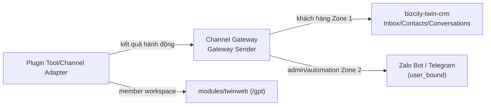

# 05 — Surface Unification: `/gpt` (twinweb) cho member, CRM cho khách hàng

> **Status:** ✅ CANON HIỆN HÀNH — tổng hợp lại các rule R-TWEB (spec đầy đủ ở
> `modules/twinweb/docs/`), R-ZONE
> ([PHASE-0-RULE-ZONE-CHANNEL.md](../rules/PHASE-0-RULE-ZONE-CHANNEL.md)) và
> R-CRM-FRAMEWORK (mô tả trong
> [copilot-instructions.md](../../.github/copilot-instructions.md) mục cuối)
> áp dụng riêng cho ranh giới plugin.

---

## 1. Phát biểu gốc

> *"Tất cả đi ra ngoài đều unify qua surface `modules/twinweb` (`/gpt` kênh
> của tôi). Tất cả dòng chảy data khách hàng đều qua surface
> `bizcity-twin-crm` để quản lý."*

Đây là 2 bề mặt (surface) khác nhau cho 2 đối tượng khác nhau — không được
trộn:

| Surface | Đối tượng | Owner | Zone |
|---|---|---|---|
| `/gpt` (`modules/twinweb`) | Member/guest tự chat trực tiếp với Twin GPT (workspace cá nhân) | `modules/twinweb` | Không phải Zone 1/2 CRM — là workspace member riêng, xem R-TWEB |
| CRM Inbox (`plugins/bizcity-twin-crm`) | Khách hàng nhắn qua Messenger/Zalo OA/Zalo Personal/WebChat — cần nhân viên/AI trả lời có audit | `plugins/bizcity-twin-crm` | Zone 1 `guest_channel` |
| Kênh admin/automation (Zalo Bot/Telegram) | Admin/nhân viên ra lệnh cho hệ thống | `core/automation` + `core/channel-gateway` | Zone 2 `user_bound` |

### 1.2 Quy tắc phân nhóm UI trong `/gpt/`

Trong **Kênh của tôi**, hai nhóm hiển thị bắt buộc là:

```text
Kênh chăm sóc khách hàng
  Facebook · Tiktok · Zalo OA · Zalo Cá nhân · Web (future)

Quản trị nội bộ
  Twin GPT + Zalo Bot (một line UI chung)
```

“Một line UI chung” không có nghĩa là gộp identity hoặc transport: Twin GPT
vẫn là member workspace, còn Zalo Bot vẫn là Zone 2 command channel. Zalo Bot
không được đặt cạnh Zalo OA/Zalo Cá nhân như một customer-care account. CRM
Inbox chỉ là owner của inbound customer-care data; line nội bộ không tạo CRM
Inbox customer.

### 1.1 C `/gpt/` là first-user-id và default-deny PII

Khi CRM/channel projection xuất hiện trong `/gpt/`, thứ tự bắt buộc là
`identity.user_id → tenant → allowed scope → query → server redaction → UI`.
Không được render CRM BE table rồi ẩn cột bằng frontend. Đặc biệt, phone/mobile
của contact Zalo Personal, provider UID, assignment và audit PII phải được
omit/mask nếu không thuộc projection của member hiện tại. `manage_options` chỉ
có ý nghĩa ở surface BE/admin đã phân loại, không phải fallback owner trong C.
Chi tiết contract tại
[PHASE-0-RULE-TWIN-GPT-FIRST-USER-ID-PII-SURFACE.md](../rules/PHASE-0-RULE-TWIN-GPT-FIRST-USER-ID-PII-SURFACE.md).

## 2. Vì sao plugin không được tự dựng UI chat/inbox riêng

Một khái niệm user-facing chỉ có **một UI/state owner** — nguyên tắc đã lặp
lại xuyên suốt framework (R-TWEB-*, R-CRM-FRAMEWORK). Nếu plugin tự vẽ UI chat
riêng cho khách hàng, hệ thống sẽ có N nơi lưu trạng thái hội thoại, N nơi
audit, N nơi tính quota — phá vỡ toàn bộ mô hình 1 CRM duy nhất quản lý dữ
liệu khách hàng.

## 3. Plugin thuộc nhóm Act/Channel giao tiếp ra ngoài như thế nào



- Plugin nhóm **Channel** (xem [06](06-PLUGIN-TAXONOMY-ACT-CHANNEL-VIEW.md))
  chỉ được implement Channel Adapter Interface, đăng ký zone rõ ràng
  (`guest_channel` hay `user_bound`), gửi tin qua `BizCity_Gateway_Sender` —
  không tự viết logic gửi tin trực tiếp API provider.
- Plugin nhóm **Act** thực thi hành động rồi trả kết quả qua Tool response —
  Runtime tự quyết định hiển thị kết quả ở đâu (Timeline nếu là `/gpt`, hoặc
  CRM message nếu là phản hồi khách hàng).
- Plugin nhóm **View** chỉ được thêm workspace/dashboard MỚI cho chính nó
  (đăng ký qua Navigation Registry) — không được thay thế hoặc nhúng lại UI
  của `/gpt`/CRM.

## 4. Dữ liệu khách hàng — luôn qua CRM, không có ngoại lệ

Theo R-CRM-FRAMEWORK: mọi CRM message/contact/conversation write phải đi qua
Repository + `BizCity_CRM_Event_Emitter` — không `$wpdb->insert/update` trực
tiếp từ plugin/controller/React. Nếu plugin của bạn cần lưu tương tác với
khách hàng (vd: đơn hàng phát sinh từ hội thoại), nó phải:

1. Thực thi hành động nghiệp vụ của mình (tạo đơn hàng Woo...).
2. Trả kết quả về qua Tool response.
3. Để Runtime/Automation ghi nhận vào `bizcity_crm_events`/CRM message theo
   đúng contract sẵn có (`build_event_metadata()`, `metadata.inbound`).

Plugin không tự tạo bảng "lịch sử tương tác khách hàng" song song với CRM.

## 5. Anti-pattern CẤM

- ❌ Plugin tự dựng trang `/plugin-slug/chat` làm kênh chat riêng cho khách
  hàng ngoài `/gpt` và CRM.
- ❌ Plugin ghi thẳng `bizcity_crm_messages`/`bizcity_crm_conversations` bằng
  `$wpdb` thay vì qua Repository của CRM.
- ❌ Plugin Zone 2 (Zalo Bot/Telegram) đọc/ghi dữ liệu Zone 1 (CRM khách
  hàng) — vi phạm cách ly R-ZONE.
- ❌ Plugin hiển thị kết quả của mình bằng cách nhúng iframe/thay thế UI
  `/gpt` thay vì đăng ký 1 workspace `View` riêng.

## 6. Tham chiếu

- [PHASE-0-RULE-ZONE-CHANNEL.md](../rules/PHASE-0-RULE-ZONE-CHANNEL.md)
- [PHASE-0-RULE-CHANNEL-UNIFY.md](../rules/PHASE-0-RULE-CHANNEL-UNIFY.md)
- `modules/twinweb/docs/PHASE-0-TWINWEB-PUBLIC-FRONTEND.md` (spec R-TWEB đầy đủ)
- Mục R-CRM-FRAMEWORK trong [.github/copilot-instructions.md](../../.github/copilot-instructions.md)
